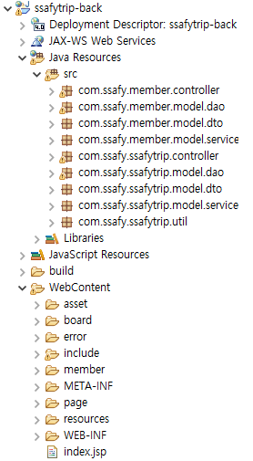

# Back - SSAFY TRIP

### 프로젝트 개요

사용자에게 한국의 다양한 관광지, 먹거리, 축제, 행사, 레포츠, 여행코스 등을 소개하여 지역 관광 활성화를 위한 지역 관광 소개 페이지를 구축한다.

프로젝트의 데이터는 공공데이터포털([https://www.data.go.kr/](https://www.data.go.kr/))에서 한국관광공사에서 제공하는 국문관광정보서비스_GW 을 크롤링한 dump db 를 사용한다.

기존 Front 관통 프로젝트와 이어지는 것으로 Front 의 디자인에 JSP, Servlet을 활용하여 MVC 패턴으로 웹 페이지를 구현한다.

### 구성원

- SSAFY 9th 대전 6반 송찬환
- SSAFY 9th 대전 6반 최하영

### 개발 환경

**IDE**

- Visual Studio Code (version 1.74 Windows x64)
- eclipse 2018-09 Enterprise Edition
- MySQL Workbench 8.0 CE

**사용언어**

- HTML, CSS, JavaScript
- java, jsp, mysql

**활용 라이브러리**

- Swiper API
- Kakao Map API
- [data.go.kr](http://data.go.kr) - 한국관광공사_국문 관광정보 서비스_GW API 크롤링 데이터 db
- mysql-connector-j-8.0.32
- jackson-annotations-2.12.4
- jackson-core-2.12.4
- jackson-databind-2.12.4
- jstl-1.2

**테스트 브라우저**

- Chrome (버전 111.0.5563.65) 64bit
- Microsoft Edge (버전 111.0.1661.41) 64bit

### 프로젝트 구조

**클래스 다이어그램**

**파일 구조**

- com.ssafy.member 패키지 - 로그인, 로그아웃 등 회원 관리
- com.ssafy.ssafytrip 패키지 - MVC 패턴에 맞춰 웹 페이지 관리
- com.ssafy.ssafytrip.util 패키지 - DB 유틸리티 클래스가 위치
- WebContent/
    - asset 폴더 - css, js, img 파일
    - board 폴더 - 정보공유게시판과 관련된 페이지
    - error 폴더 - error 페이지
    - include 폴더 - header, head, footer, path 등 jsp에 삽입하기 위한 파일
    - member 폴더 - 로그인, 회원가입, 회원정보수정 등 회원 관련 페이지
    - page 폴더 - 관광지와 관련된 페이지
    - resources 폴더 - 데이터베이스 sql 파일
    - index.jsp - Home 화면

### 프로젝트 기능별 화면

**메인 화면 (index.jsp)**

- 사이트 맵
    - 인기여행지, 축제, 문화시설, 레포츠, 관광지 조회, 정보공유게시판
- 상단 배너
    - 관광지 데이터 중 랜덤으로 3개를 가져와 배치
    - Swiper로 상단 배너를 구현 (3개의 슬라이드가 3초에 한번씩 슬라이드)
- 인기여행지, 축제, 문화시설, 레포츠
    - 각 데이터 중 조회수가 가장 높은 3개를 가져와서 배치
    - See more 버튼 클릭시 리스트 페이지로 이동한다

**인기, 축제, 문화시설, 레포츠 목록 (list.jsp)**

- 인기, 축제, 문화시설, 레포츠 목록을 나열하는 페이지
    - 각 탭은 같은 페이지를 사용하며, 파라미터에 따라 상단 제목이 달라진다.
    - 데이터는 조회수가 가장 높은 것이 상단에 노출되는 구조로 되어 있다.

**지역별관광지조회 (search-info.jsp)**

- 관광지 정보 조회 페이지
- 지역, 구/군, 컨텐츠, 검색어를 통해 검색할 수 있으며, 검색된 결과가 지도에 마커로 표시도록 구현
- 오른쪽 리스트의 각 항목을 클릭했을 때 해당 위치로 지도가 이동한다.

**상세정보조회 (detail.jsp)**

- 메인페이지, 목록페이지 등에서 관광지를 클릭했을 때 상세 정보 조회 페이지로 이동할 수 있다.
    - 상단 메인 배너에 대표이미지가 위치
    - 중단에 지도와 선택관광지의 설명
    - 하단에 주소와 이 관광지에서의 활용이미지 여러장이 위치

**정보공유 게시판 (detailBoard.jsp, listBoard.jsp, registBoard.jsp)**

- 유저들끼리 정보를 공유하기 위한 게시판 기능

**로그인 (login.jsp)**

- 이메일과 비밀번호를 입력하는 로그인 폼
- 로그인 실패시 alert 알람
- 이메일 기억하기를 통해 로그인 성공 시 이메일 정보를 쿠키에 저장

**회원가입 (signup.jsp)**

- 이메일, 닉네임, 비밀번호 정보로 회원가입이 가능하다
- 회원가입 실패시 사용자에게 alert로 알람을 준다

**회원정보 수정(userinfo.jsp)**

- 로그인 상태에서 유저는 닉네임과 비밀번호를 수정할 수 있다.

